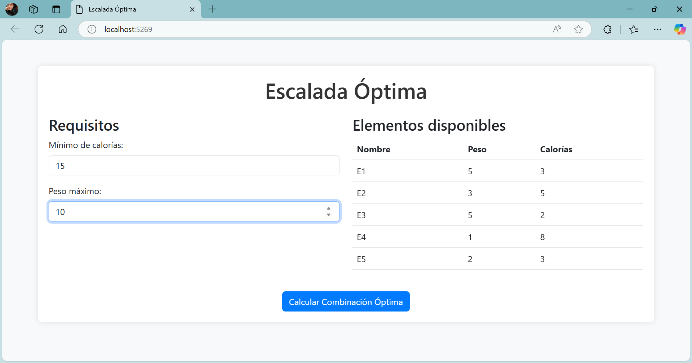

# EscaladaOptima
Determinar los elementos que puedan usarse para escalar un risco basado en las propiedades calóricas y peso de cada elemento, para escalar el risco se especificara la cantidad mínima de calorías además del peso máximo que se puede llevar.



## Características
- **Listado de elementos** con sus respectivos pesos y calorías.
- **Cálculo de combinación óptima**, maximizando el peso y garantizando un mínimo de calorías.
- **Interfaz interactiva** para ingresar los parámetros y visualizar los resultados.
- **API REST** para la obtención de elementos y cálculos.

---

## 🚀 Instalación y Ejecución

### Requisitos Previos
- .NET 6.0 o superior
- Visual Studio / VS Code


### Clonar el repositorio
```sh
git clone https://github.com/MakeCodeKraus/EscaladaOptima.git
cd EscaladaOptima